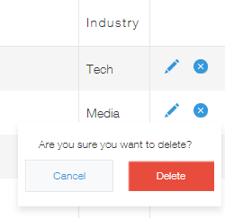

### Delete Event - `app.record.index.delete.submit` {#delete-event}

An event triggered when the "Delete" button is clicked on the pop-up that appears when the delete icon of a record is clicked on the record list.

#### Function {#function}

`app.record.index.delete.submit`

#### Properties of the Event Object {#properties-of-the-event-object}

| PROPERTY | TYPE | DESCRIPTION |
| :-- | :-- | :-- |
| appId | Number | The App ID. |
| recordId | Number | The Record ID. |
| record | Object | A record object that holds data of the record that will be deleted. |
| type | String | The event type. |

#### Cancel Actions {#cancel-actions}

Actions can be cancelled by doing one of the following:

- [Show record errors](/docs/kintone/js-api/events/event-object-actions/#record-list-show-record-errors)
- return `false`

#### Available Event Object Actions {#available-event-object-actions}

- [Show record errors](/docs/kintone/js-api/events/event-object-actions/#record-list-show-record-errors)

#### Deleting a record after waiting for asynchronous operations to finish {#deleting-a-record-after-waiting-for-asynchronous-operations-to-finish}

By returning a `Promise` object, you can delete a record after waiting for asynchronous operations to finish. Refer to the sample code on the following article:  
[Save Event](/docs/kintone/js-api/events/record-create-events/save-event/)

#### Notes {#notes}

- When comma-separated values, whitespaces, or double-byte characters are sanitized, as long as the final value does not change, the event will not be triggered. For example, if the user enters a value of `1000` into a field, and then proceeds to manually change the value to `1,000`, ` 1000 `, or `１０００`, the value will be sanitized back to `1000` (the same number), and the field change event will not be triggered.

#### Limitations {#limitations}

- This event is only available on the Desktop, and not on the mobile.
- Refer to the Limitations section of the following article for more details:  
  [Event Handling](/docs/kintone/js-api/events/event-handling/#limitations)
