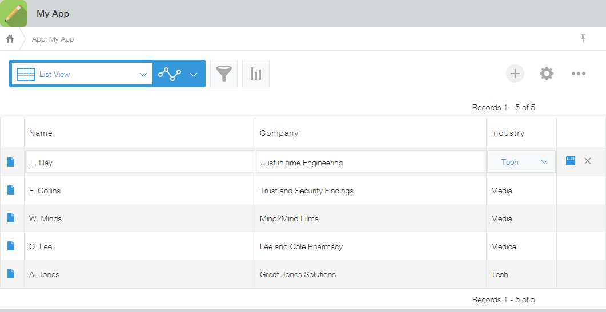

### Inline Edit Event - `app.record.index.edit.show` {#inline-edit-event}

An event triggered when an inline edit of a record starts on the record list page.

#### Function {#function}

`app.record.index.edit.show`

#### Properties of the Event Object {#properties-of-the-event-object}

| PROPERTY | TYPE | DESCRIPTION |
| :-- | :-- | :-- |
| appId | Number | The App ID. |
| recordId | Number | The Record ID. |
| record | Object | A record object that holds data of the record when the inline editing started. |
| type | String | The event type. |

#### Available Event Object Actions {#properties-of-the-event-object}

- [Enable/Disable field edits](/docs/kintone/js-api/events/event-object-actions/#record-list-enable-disable-field-edits)
- By returning a `Promise` object in the event handler, event object actions can be processed after waiting for asynchronous processes in the event handler to finish.

#### Limitations {#limitations}

- This event is only available on the Desktop, and not on the mobile.
- Refer to the Limitations section of the following article for more details:  
  [Event Handling](/docs/kintone/js-api/events/event-handling/#limitations)
